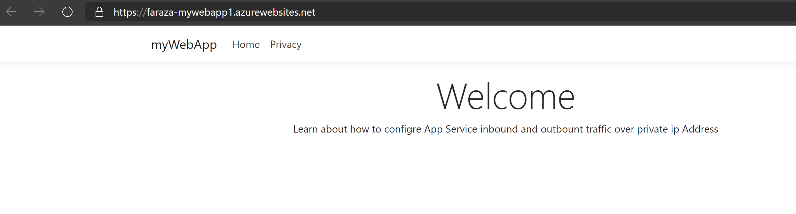

Inject App Service in a Virtual Network.

## Introduction.
Lot of customer have requirement to run Azure App Service in a virtual network with private IP for inbound and outbound. There is no perfect solution at this time until we have Private Link enabled for App Service.

An Azure App Service can act as if it in a virtual network with a private IP for inbound and with an outbound that in the virtual network if you combine
1)	Service Endpoint + Application Gateway
2)	User Reginal VNet integration (preview)

This article is written only for multi-tenant App Service.

Before you start deploying in your lab, read about the App Service VNet Integration and Networking features here and here.

## Pre-Requisutes.
There are two parts to this configuration besides creating App Service and the Application Gateway. The first part is enabling service endpoints in the subnet of the virtual network where the Application Gateway is deployed. Service endpoint will ensure all network traffic leaving the subnet towards the App Service will be tagged with the specific subnet ID. The Second part is to set the access restriction of the specific web app to ensure that only traffic tagged with this specific subnet ID is allowed. 

1)	Two Virtual Network, and a subnet in each Virtual Network, one Virtual Network subnet will be suing for Application Gateway and Second Virtual Network Subnet is for App Service vNet Integration. 
2)	Two Virtual Network’s is not a requirement, this lab can be setup using one Virtual Network.
3)	Peering between two Virtual Networks.
4)	Azure Cloud Shell. 
5)	Visual Studio 2019
We will create app service using Azure Cloud Shell and Deploy Sample app using Visual Studio 2019.

## Step By Step

### At high level steps
1)  Create Virtual Networks, create peering between Virtual Networks.
2)  Create App Service using CLI
3)  Publish a sample app using Visual Studio 2019
4)  Create Application Gateway using CLI
5)  Configure App Service as a backend in Application Gateway
6)  Create the access restriction using service endpoints.

### Step 1
Virtual Networks using Azure CLI from NetworkCreation.sh script.

### Step 2
Create App Service using CLI

#### Create a resource Group
az group create --location eastus --name AppServNetInteg

#### Create a app service plan
az appservice plan create --name myAppServPlan --resource-group AppServNetInteg --sku S1 

#### Create a web app.
az webapp create --resource-group AppServNetInteg --plan myAppServPlan --name faraza-mywebapp1

#### Step 3
Publish a sample app using Visual Studio 2019.

Create an ASP.NET Core web app by following these steps:
1.	Open Visual Studio and then select Create a new project.
2.	In Create a new project, find and choose ASP.NET Core Web Application for C#, then select Next.
3.	In Configure your new project, name the application myFirstAzureWebApp, and then select Create.

4.  For this quickstart, choose the Web Application template. Make sure authentication is set to No Authentication and no other option is selected. Select Create.

5.  From the Visual Studio menu, select Debug > Start Without Debugging to run the web app locally.

### Publish your web app
1.  In Solution Explorer, right-click the myFirstAzureWebApp project and select Publish.
2.  Choose App Service and then select Publish.

3.  In App Service Select Existing, your options depend on whether you're signed in to Azure already and whether you have a Visual Studio account linked to an Azure account. Select either Add an account or Sign in to sign in to your Azure subscription. If you're already signed in, select the account you want.
4.  If you have more then one Subscription, select the one where resource group was crated in previous step.
5.  Select Resource Group or Resource Type, then select WebApp that was created in revious steps. Move to next step, and select Publish.
6.  After Publish complete, you should see browser should open up and display the website you just published.

### Step 4
Create Application Gateway using CLI

az network application-gateway create --resource-group AppServNetInteg --name MyAppGateway \
--capacity 2 --sku Standard_v2 \
    --vnet-name AppGWVNet --subnet AppGWvsub \
	--http-settings-cookie-based-affinity Enabled \
    --public-ip-address MyAppGWPubIP \
    --private-ip-address 10.6.0.101

If some reason Front IP Configurations, Type Private is not configured, login into the Azure portal set the Private IP, use a unused private IP from the subnet used in Application Gateway creations.

### Step 5
Configure App Service as a backend in Application Gateway

Use steps outlined in the below article to confiure App Service as a backend in Application Gateway.
https://docs.microsoft.com/en-us/azure/application-gateway/configure-web-app-portal

### Step 6
Create the access restriction using service endpoints.

